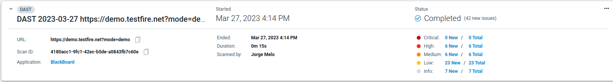
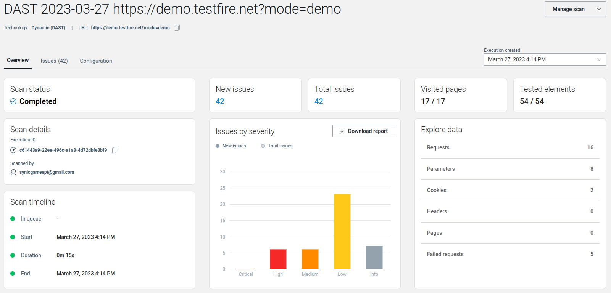
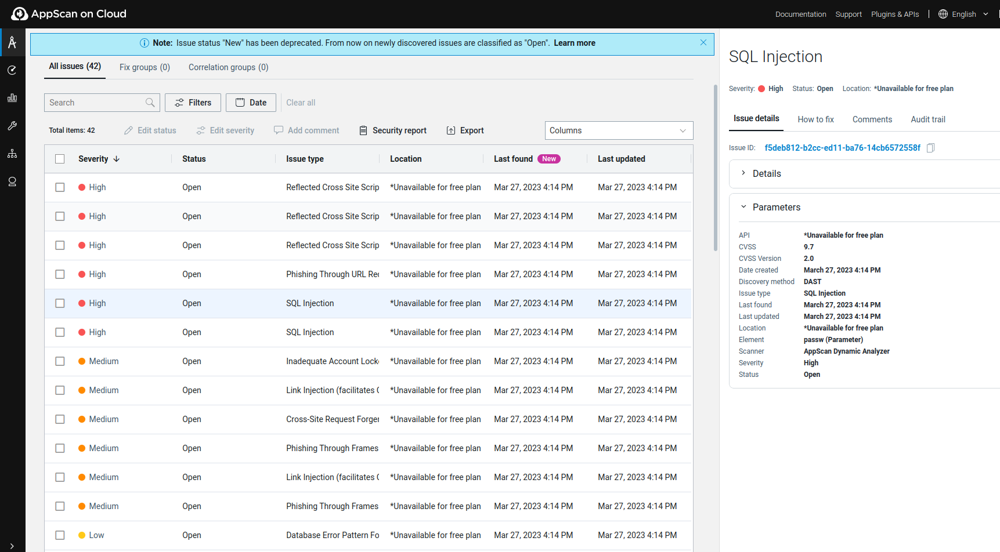

# AppScan

Para a demonstração foi utilizada a demo já feita pela própria aplicação para ser testada por vulnerabilidades

Podemos ver, depois do scan, uma informação resumida do que foi detetado.

De seguida, também podemos ver uma versão mais detalhada das vulnerabilidades encontradas.

Para além disso, també podemos ver mais detalhadamente cada uma das vulnerabilidades, entre muitas outras opções.

